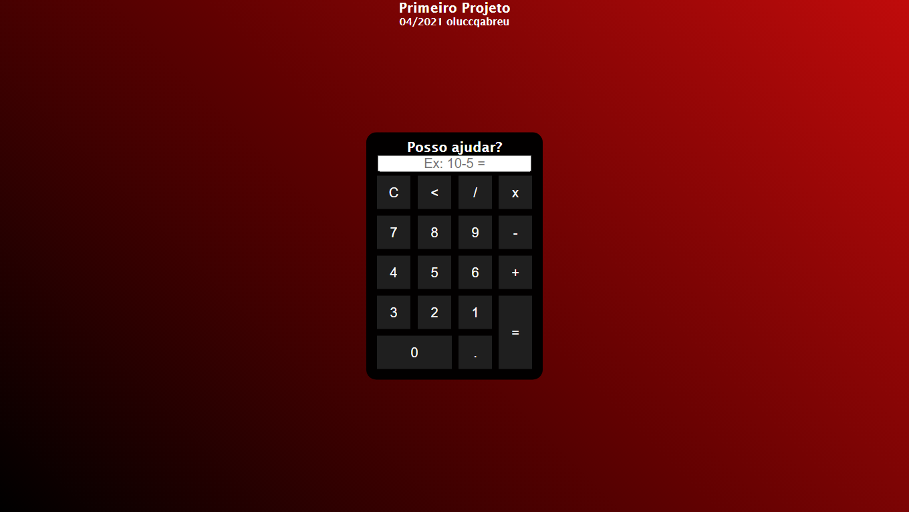

Primeiro projeto - Calculadora (CalcGit).

A calculadora 'CalcGit' foi o meu primeiro projeto já feito. Ela passou por algumas atualizações até chegar nessa versão final.
Obs: CalcGit foi inspirada em um projeto tutorial do youtube, tendo assim, suas modificações.

Criada em Abril de 2021.
oluccqabreu <--

 "Primeiro aprender a ficar em pé, depois aprender a voar. Lei da natureza."
 
 
